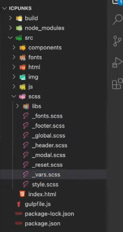

## TODO
- [x] Переделка структуры шаблона
- [x] Добавление новых плагинов для *gulp*
  - [x] html @@include
  - [ ] other
- [x] Добавление новых функций в gulp
  - [x] gulp clean
  - [x] gulp build
- [ ] Добавить паттерны
  - [ ] Slider
  - [ ] NavBar
  - [ ] Accordion
  - [ ] Tabs
  - [ ] Forms
    - [ ] Radio
    - [ ] Checkbox
  - [ ] Smooth Scroll
  - [ ] modal
  - [ ] Burger
  - [ ] Section
    - [ ] 1 column
    - [ ] 2 columns
    - [ ] 3 columns
- [x] Добавить media breakpoints
- [x] Добавить правила формирования имен классам

## Structure example
